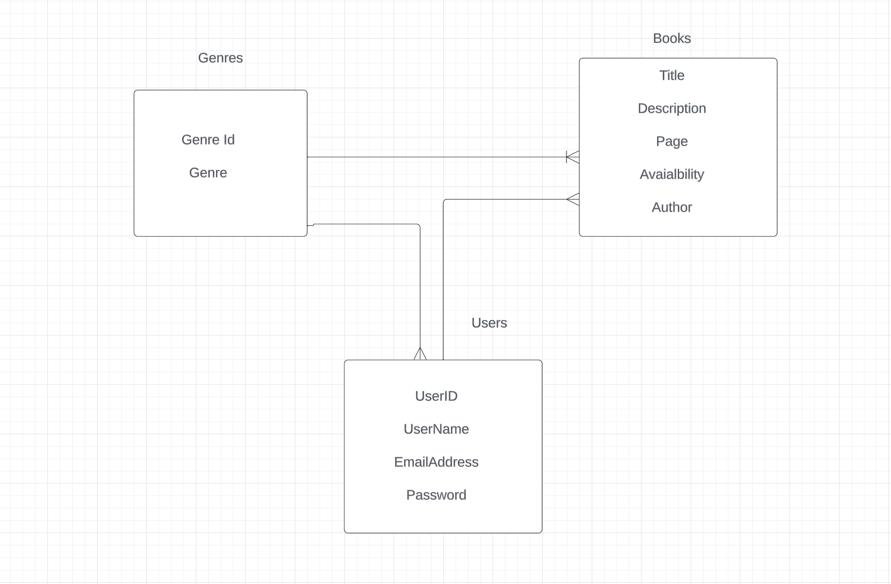

# Springboot Mini Project - Backend Library

## Project Descripåtion
This project is a backend library consisting of three main models: Genre, Book and User. It utilizes the H2 database and implements Spring Security along with JWT tokens for authentication and authorization. The application provides API endpoints for CRUD operations on genres and books, following REST conventions. It also handles exceptions and ensures implementation to KISS and DRY principles.

## Tools and Technologies
- Java
- Spring Boot
- H2 Database
- Spring Security
- JWT Authentication

## Approach
The project followed a structured approach:
1. **Database Models**: Defined three models: User, Genre, and Book, with their relationships.
2. **Authentication**: Implemented Spring Security and JWT tokens for secure API access.
3. **Controller-Service Pattern**: Divided the application into controllers and services for better organization.
4. **RESTful Endpoints**: Created CRUD endpoints for genres and books, following REST conventions.
5. **Exception Handling**: Implemented exception handling to provide meaningful error messages to users.
6. **Documentation**: Properly documented code with doc strings and inline comments.

## Entity Relationship Diagram (ERD)

## Unsolved Problems
Although the project is fully equipped with the essential backend components for seamless library access and management, it currently lacks specific CRUD (Create, Read, Update, Delete) operations tailored to user-based access. Instead, the CRUD operations are implemented with a focus on genres and books.

## User Stories

USER STORIES:

**As a User, I want to:**

1. **View Books:**

    - **What I Want:** I want to be able to view a list of available books, their titles, authors, and descriptions.

    - **Why:** I want to explore the catalog of books and learn more about the ones that interest me.

2. **Search for Books:**

    - **What I Want:** I want to search for books by title, author, or genre to quickly find specific books.

    - **Why:** This helps me find books I'm looking for without scrolling through a long list.

3. **See Book Details:**

    - **What I Want:** I want to see detailed information about a specific book, including its author, genre, and a summary.

    - **Why:** I want to learn more about a book before deciding to read it.

4. **Manage My Reading List:**

    - **What I Want:** I want to add books to my reading list, mark them as read or unread, and remove them from the list.

    - **Why:** This helps me keep track of books I want to read or have already read.

5. **Explore Genres:**

    - **What I Want:** I want to see a list of genres and explore books within a specific genre.

    - **Why:** This allows me to discover books within categories I'm interested in.

6. **Register and Log In:**

    - **What I Want:** I want to register for an account, log in securely, and maintain my account settings.

    - **Why:** This ensures a personalized experience and access to features like managing my reading list.

7. **Administer the System (Admin User):**

    - **What I Want:** I want to add, update, and delete books, genres, and user accounts as an administrator.

    - **Why:** This allows me to maintain the system and its content.

   ### Key Achievements:
1. **Database Models:** Defined robust models for User, Genre, and Book with appropriate relationships.
2. **Authentication:** Implemented secure authentication using Spring Security and JWT tokens.
3. **Controller-Service Pattern:** Organized the application into controllers and services for better code organization.
4. **RESTful Endpoints:** Created CRUD endpoints for genres and books, promoting interoperability.
5. **Exception Handling:** Ensured a smooth user experience by implementing comprehensive exception handling.
6. **Documentation:** Maintained code documentation with doc strings and inline comments for future reference.

### Future Considerations:
While the project currently focuses on genres and books, future enhancements could include:
- Expanding reading list functionality with features like favorites, reviews, and ratings.
- Implementing advanced search and filtering options for books.
- Enhancing security with features like email confirmation and account lockout.
- Improving scalability through pagination and sorting of book lists.

Overall, this project lays a strong foundation for a library management system and provides a solid base for future feature additions and improvements.

